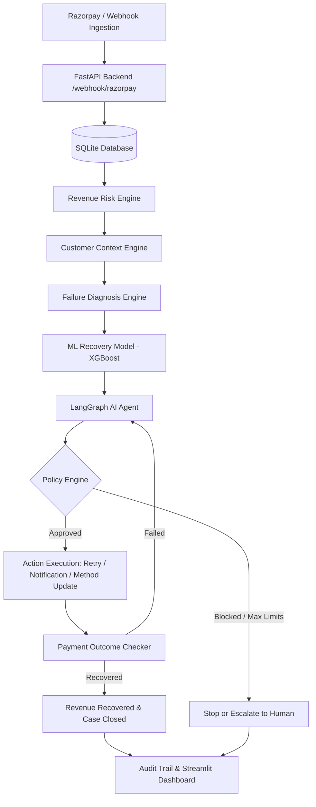

# RecoverAI: An Agentic AI System for Subscription Revenue Recovery

[](https://www.python.org/downloads/)
[](https://fastapi.tiangolo.com)
[](https://github.com/langchain-ai/langgraph)
[](https://xgboost.readthedocs.io/)
[](https://razorpay.com)

**RecoverAI** is an intelligent, bounded agentic AI layer built on top of the Razorpay subscription and payment lifecycle. When recurring subscription payments fail, RecoverAI automatically ingests the failure event, evaluates customer context and history, diagnoses root causes, predicts the recovery probability using machine learning, selects personalized recovery interventions via a LangGraph AI agent, strictly enforces compliance through a deterministic Policy Engine, and verifies payment outcomes while recording a complete audit trail.

---

##  System Architecture



---

##  Key Features

1. **Revenue-At-Risk & Customer Context Engine**: Real-time evaluation of immediate revenue risk, customer lifetime value (LTV), past payment success ratios, and subscription age.
2. **Deterministic Failure Classification**: Maps gateway error codes into structured categories:
   - `INSUFFICIENT_FUNDS`
   - `EXPIRED_CARD`
   - `BANK_DECLINE`
   - `GATEWAY_ERROR`
   - `MANDATE_FAILURE`
   - `UNKNOWN`
3. **Machine Learning Recovery Prediction**: Calibrated classification models (Logistic Regression, Random Forest, XGBoost) trained on 50,000 realistic payment records, evaluated on both standard statistical metrics and **Revenue-Weighted Recovery Performance**.
4. **LangGraph Agent Workflow**: StateGraph managing autonomous step-by-step reasoning (`observe` ? `diagnose` ? `predict` ? `reason` ? `policy_validate` ? `execute` ? `verify`).
5. **Deterministic Policy Engine (Bounded Autonomy)**:
   - `MAX_RETRIES = 3`
   - `MAX_CUSTOMER_CONTACTS = 2`
   - `MIN_RETRY_INTERVAL = 12 hours`
   - Escalation threshold: `recovery_probability < 0.20`
   - Automatic termination upon successful payment, opt-out, or max attempts reached.
6. **Executive Streamlit Dashboard**:
   - Live revenue recovery KPI cards
   - Step-by-step visual case timeline explorer
   - 1,000-case batch simulation engine comparing **No Recovery** vs **Fixed Rule Retry** vs **RecoverAI Agent**
   - Live interactive payment failure simulator.
7. **Razorpay Webhook Integration**: HMAC SHA-256 signature verification and event handling for `payment.failed`, `payment.captured`, and subscription webhooks.

---

##  ML Benchmark & Simulation Results

### Model Comparison on 50,000 Records
| Model | Accuracy | Precision | Recall | F1 Score | ROC-AUC | Revenue-Weighted Recovery |
| :--- | :---: | :---: | :---: | :---: | :---: | :---: |
| **Logistic Regression** | 72.86% | 75.41% | 89.59% | 0.8189 | 0.7350 | **91.66%** |
| **Random Forest** | 72.88% | 74.87% | 90.90% | 0.8211 | 0.7430 | **93.10%** |
| **XGBoost Classifier** | **73.08%** | **75.68%** | **89.43%** | **0.8198** | **0.7430** | **92.63%** |

### 1,000-Case Batch Simulation Benchmark
| Strategy | Revenue Recovered | Recovery Rate | Interventions | Conversion Efficiency |
| :--- | :---: | :---: | :---: | :---: |
| **Baseline 1: No Recovery** | ?0.00 | 0.0% | 0 | 0.0% |
| **Baseline 2: Fixed Rule Retry** | ?6,82,420.00 | 32.79% | 1,000 | Low (Blind retries fail on expired cards & mandate issues) |
| **RecoverAI Agent (Ours)** | **?14,91,789.00** | **71.69%** | **842** | **High (+118.6% Uplift vs Fixed Strategy)** |

---

##  Quick Start Guide

### 1. Installation
```bash
# Clone the repository
git clone https://github.com/your-org/razorpay-revenue-recovery-agent.git
cd razorpay-revenue-recovery-agent

# Create and activate virtual environment
python -m venv venv
# Windows:
.\venv\Scripts\activate
# Linux/macOS:
source venv/bin/activate

# Install dependencies
pip install -r requirements.txt
```

### 2. Configure Environment
```bash
cp .env.example .env
```
*(Optionally provide your Razorpay Test keys or OpenAI/Groq API key in `.env`. RecoverAI runs seamlessly out of the box with calibrated simulation fallbacks).*

### 3. Run FastAPI Backend
```bash
uvicorn backend.main:app --port 8000 --reload
```
API Documentation available at: `http://127.0.0.1:8000/docs`

### 4. Run Streamlit Dashboard
```bash
streamlit run frontend/app.py
```
Dashboard available at: `http://localhost:8501`

---

##  Running Tests

Run the complete automated test suite:
```bash
pytest tests/ -v
```

---

##  Repository Structure

```
RecoverAI/
+-- README.md
+-- requirements.txt
+-- .env.example
+-- .gitignore
¦
+-- backend/
¦   +-- main.py                # FastAPI endpoints & lifecycle
¦   +-- database/
¦   ¦   +-- db.py              # Thread-safe SQLite layer
¦   ¦   +-- models.py          # Pydantic & database schemas
¦   +-- razorpay/
¦   ¦   +-- client.py          # Razorpay Test Mode client wrapper
¦   ¦   +-- webhook.py         # Signature validation & payload parsing
¦   +-- agent/
¦   ¦   +-- state.py           # LangGraph AgentState TypedDict
¦   ¦   +-- tools.py           # Controlled execution tools
¦   ¦   +-- nodes.py           # Observation, diagnosis, reason, policy nodes
¦   ¦   +-- graph.py           # Compiled LangGraph workflow
¦   +-- ml/
¦   ¦   +-- train.py           # Synthetic dataset generator & multi-model trainer
¦   ¦   +-- predict.py         # Inference service with calibrated fallback
¦   ¦   +-- model.pkl          # Exported model artifact
¦   +-- policy/
¦   ¦   +-- rules.py           # Deterministic Policy Engine & guardrails
¦   +-- services/
¦       +-- recovery.py        # Ingestion pipeline & batch simulation
¦       +-- audit.py           # Audit logging service
¦
+-- frontend/
¦   +-- app.py                 # Multi-view Streamlit dashboard
¦
+-- data/
¦   +-- sample_payments.csv    # 50,000 generated payment records
¦
+-- tests/
    +-- test_policy.py         # Policy & guardrail unit tests
    +-- test_recovery.py       # End-to-end recovery agent tests
    +-- test_webhook.py        # Webhook signature & parsing tests
```

